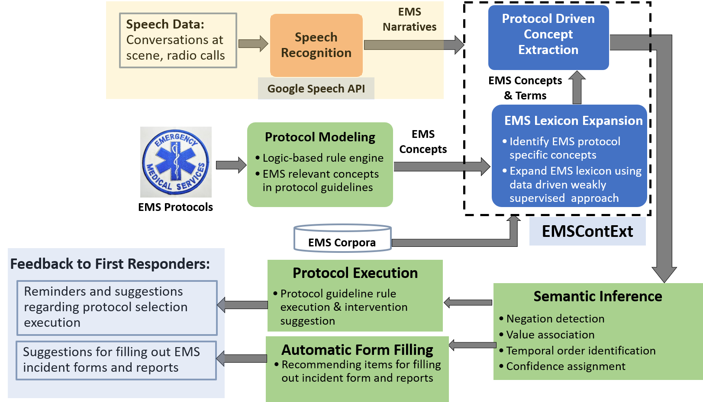
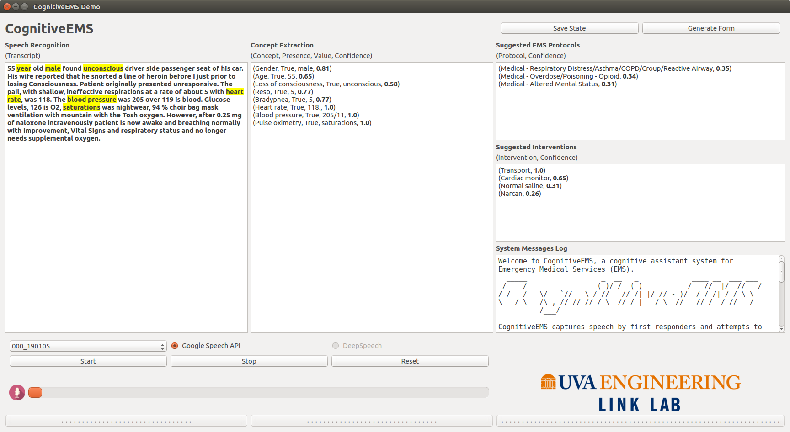

# EMS Pipeline
Thie repository contains a real-time protocol-driven decision support pipeline for Emergency Medical Serivces (EMS). The system-level implementation is shown below:

## Demo
The `Demo/` directory contains a demonstration of the system in form of a graphical user interface (GUI):

 The GUI is built with PyQt4 and has been succesfully tested on:

`64-bit Ubuntu 16.04 LTS`  
`Intel® Core™ i7-7700 CPU @ 3.60GHz × 8`

### Requirements
The project requires Python 2.7  
Most packages could be installed with pip. Some other requirements are:

#### MetaMap:
**MetaMap 2016v2** needs to be installed under the `Demo/public_mm` directory. Downloads are hosted at:  
<https://metamap.nlm.nih.gov/MainDownload.shtml>  

You will need a UMLS account/license. You can request one here:  
<https://uts.nlm.nih.gov/license.html>  

Instruction for installing MetaMap are here:  
<https://metamap.nlm.nih.gov/Installation.shtml>

#### PyMetaMap:
**PyMetaMap** is a Python Wrapper around MetaMap. It needs to be installed in the `Demo/pymetamap` directory. The software is already in this directory, but needs to be built:

`cd pymetamap`  
`python setup.py install`  

For more information, visit: <https://github.com/AnthonyMRios/pymetamap>

#### Google Cloud Speech API:
To use the **Google Cloud Speech API**, you need to have your own service account key in JSON format. The service account must have the Speech API enabled. It needs to be in the demo folder:  

`Demo/service-account.json`

For more information, visit: <https://cloud.google.com/speech-to-text/>

#### DeepSpeech Models (Optional):

**DeepSpeech** functionality is currently **disabled** in the demo. The models are not needed, but they could be downloaded by running:

`mkdir DeepSpeech_Models`  
`cd DeepSpeech_Models`  
`wget https://github.com/mozilla/DeepSpeech/releases/download/v0.5.1/deepspeech-0.5.1-models.tar.gz`  
`tar xvfz deepspeech-0.5.1-models.tar.gz`

For more information and link to more recent models, visit: <https://github.com/mozilla/DeepSpeech>

### Running the Demo

Make the `metamap.sh` executable by running (this step is only needed to be run once on every machine):

`chmod +x metamap.sh`

To run MetaMap, run (this step needs to repeated after every reboot):

`./metamap.sh`

To launch the graphical user interface (GUI), run:

`Python GUI.py`

## Publications

["A Behavior Tree Cognitive Assistant System for Emergency Medical Services"](http://faculty.virginia.edu/alemzadeh/papers/IROS2019.pdf)  
S. Shu, S. Preum, H. M. Pitchford, R. D. Williams, J. Stankovic, H. Alemzadeh  
To appear in the IEEE IEEE/RSJ International Conference on Intelligent Robots and Systems (IROS), 2019

["CognitiveEMS: A Cognitive Assistant System for Emergency Medical Services"](http://faculty.virginia.edu/alemzadeh/papers/MEDCPS_2018.pdf)  
S. Preum, S. Shu, M. Hotaki, R. Williams, J. Stankovic, H. Alemzadeh  
In SIGBED Review, Special Issue on Medical Cyber Physical Systems Workshop (CPS-Week), 2018.
 Featured by the IWCE's Urgent Communications and UVA SEAS News, 2018.
 
["Towards a Cognitive Assistant System for Emergency Response"](http://faculty.virginia.edu/alemzadeh/papers/ICCPS_Poster_2018.pdf)  
S. Preum, S. Shu, J. Ting, V. Lin, R. Williams, J. Stankovic, H. Alemzadeh  
In the 9th ACM/IEEE International Conference on Cyber-Physical Systems (CPS-Week), 2018.
