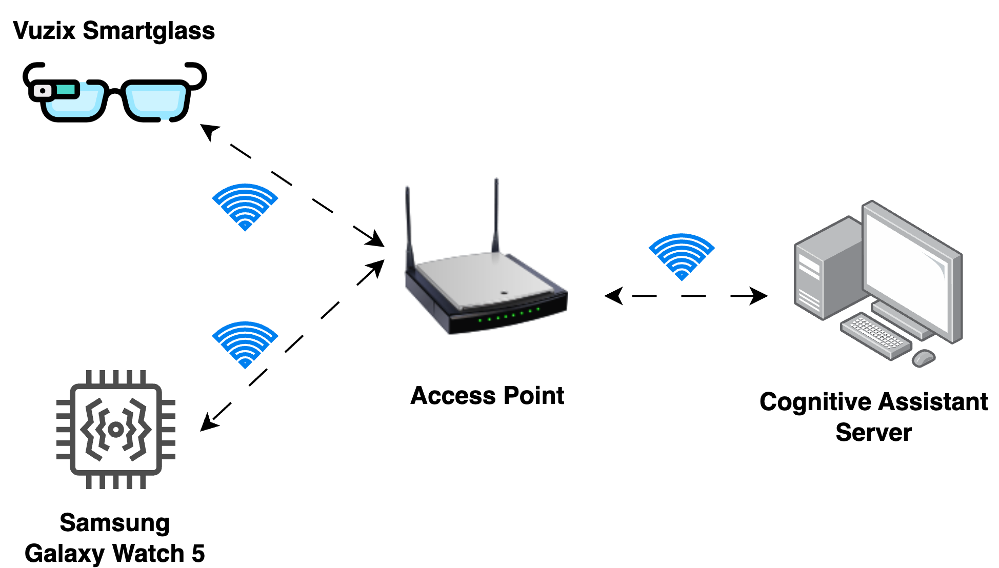
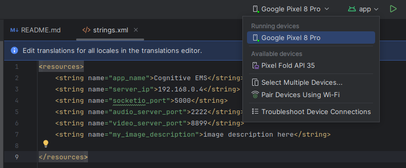
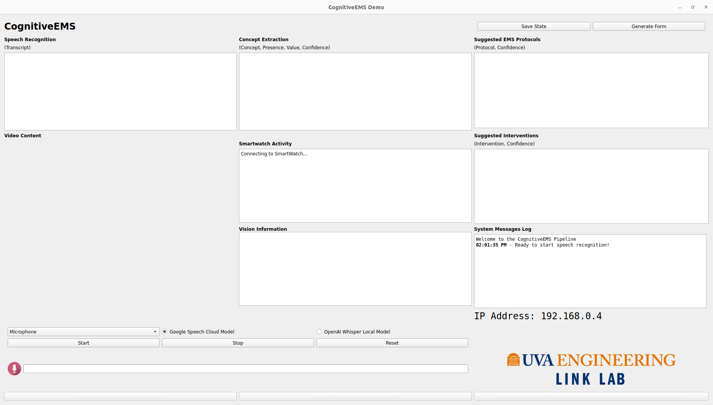

# CognitiveEMS Pipeline

## About This Project


The **CognitiveEMS Pipeline** is a decision support system designed for real-time, multimodal, and edge-deployed **Cognitive Assistant Systems for Emergency Medical Services (EMS)**. Its primary goal is to enhance situational awareness for first responders and paramedics by automatically collecting and analyzing multimodal data from incident scenes, providing actionable insights and suggestions. The system comprises advanced AI models and modular software components designed for deployment on edge devices.

For more information, visit the [project page](https://www.nist.gov/ctl/pscr/cognitive-assistant-systems-emergency-response).

---

## Demo Branch Overview

This branch contains a **portable demo** of the CognitiveEMS pipeline, featuring a GUI for Ubuntu-based systems. The demo includes:

### Server Features
- Real-time **speech recognition**.
- **Protocol prediction** based on incident data.
- **EMS object detection**.
- Preliminary version of **EMS intervention detection**.

### AR Smartglass Features
- **Augmented Reality (AR)** feedback displaying:
  - Predicted protocols.
  - Detected EMS objects.
  - Detected interventions.
- Real-time streaming of egocentric video and audio.

### Smartwatch Features
- Real-time streaming of **hand movement data**.

---

## High-Level Architecture

The CognitiveEMS pipeline employs a real-time, multi-threaded architecture to process multimodal data inputs. Its main components include:

### Core AI Models
1. **EMS-Whisper**: A fine-tuned speech recognition model for EMS audio inputs.
2. **EMS-TinyBERT**: A protocol prediction model utilizing medical knowledge and transcript analysis.
3. **EMS-Vision**: An intervention recognition model leveraging contextual knowledge and video data.


For detailed descriptions of the models, refer to the [Technical Documentation](#technical-documentation).

---

## Hardware Requirements

### Recommended Specifications

#### Server
- **Processor**: 12th Gen (or newer) Intel® Core™ i5, i7, or i9.
- **RAM**: 32GB.
- **Graphics**: NVIDIA RTX 3080 or higher.

#### Smartglass
- **Model**: [Vuzix M4000 Smart Glasses](https://www.vuzix.com/products/m4000-smart-glasses).

#### Smartwatch
- **Model**: Samsung Galaxy Watch 5.

---

### Minimum Specifications

#### Server
- **Processor**: 12th Gen Intel® Core™ i5
- **RAM**: 16GB.
- **Graphics**: NVIDIA RTX 3060

---

## Software Requirements

#### Server
- **OS**: Ubuntu 20.04.6 LTS (64-bit).
- **CUDA**: Version 12.1.
- **Environment**: Conda (Python 3.8.18).
- **Android Studio**: For android app deployments for smartglass, smartwatch.

#### Smartglass
- **OS**: Android OS.

#### Smartwatch
- **OS**: Android Wear OS.

---

## Prerequisites

### Network Configuration
- Ensure the server, smartglass, and smartwatch are on the **same network**.
- Assign a **static IP** to the server and configure it in the Android applications.
- Remove any firewall rules blocking TCP or UDP traffic.



---

## Installation 

:exclamation: Following instructions are still a work in progress.


### 1. Clone the Repository
```bash
git clone https://github.com/UVA-DSA/EMS-Pipeline.git
git checkout demo
```

### 2. Conda Environment Setup
#### Standard Setup
For hardware matching [recommended specifications](#hardware-requirements), use the provided `environment.yml` file:
```bash
cd Demo/

# dependencies for pyaudio
sudo apt-get install libasound-dev portaudio19-dev libportaudio2 libportaudiocpp0
sudo apt-get install ffmpeg libav-tools

# create the conda environment
conda env create --file environment.yml
```

#### Custom Setup

Manually install dependencies:
1. Identify your CUDA version using `nvidia-smi`.
2. Use the [PyTorch installation guide](https://pytorch.org/get-started/locally/) to install PyTorch (v2.2.0 or above), torchvision, and torchaudio for your system.
```bash
conda activate EMSProject
pip install torch==2.1.2 torchvision==0.16.2 torchaudio==2.1.2 --index-url https://download.pytorch.org/whl/cu118

# downgrade below packages in the given order.
pip install torch-geometric==2.2.0
pip install torch-sparse==0.6.17
pip install torch-scatter==2.1.1
```

3. Install additional packages:
```bash
pip install pyyaml transformers pyqt5 pandas openpyxl evaluate jiwer
sudo apt-get install libxcb-randr0-dev libxcb-xtest0-dev libxcb-xinerama0-dev libxcb-shape0-dev libxcb-xkb-dev
```

## Google Cloud Speech-to-Text API (Optional)

To enable cloud-based speech recognition:
1. Obtain a service account JSON key with the Speech API enabled.
2. Place it under the `Demo/` folder as `service-account.json`.
3. For more information, visit the [Google Cloud Speech-to-Text API](https://cloud.google.com/speech-to-text/) page.

```json
{
  "type": "service_account",
  "project_id": "",
  "private_key_id": "",
  "private_key": "",
  "client_email": "",
  "client_id": "",
  "auth_uri": "https://accounts.google.com/o/oauth2/auth",
  "token_uri": "https://oauth2.googleapis.com/token",
  "auth_provider_x509_cert_url": "https://www.googleapis.com/oauth2/v1/certs",
  "client_x509_cert_url": "",
  "universe_domain": "googleapis.com"
}

```

---

### 3. Virtual Speaker and Mic Setup
For audio input:
```bash
pactl load-module module-null-sink sink_name="virtual_speaker" sink_properties=device.description="virtual_speaker"
pactl load-module module-remap-source master="virtual_speaker.monitor" source_name="virtual_mic" source_properties=device.description="virtual_mic"
```

Set the `LD_LIBRARY_PATH`:
```bash
export LD_LIBRARY_PATH=/usr/lib/aarch64-linux-gnu/alsa-lib/:$LD_LIBRARY_PATH
```

---

## 4. Model Setup

### EMS-Whisper
1. Download the `models` folder from [here](https://drive.google.com/drive/folders/1Z4oakBCSiSyW_agq3UG1eHsQDMmHKHOA?usp=sharing) and place it under `Demo/EMS_Whisper/models/`.

### EMS-TinyBERT
1. Download the `models` folder from [here](https://drive.google.com/drive/folders/1y4Ko6iSr5zkmYbm2llNQq7cwL-cu6Qi3?usp=sharing) and place it under `Demo/EMSAgent/Interface/models/`.


### EMS-Vision
1. Download the `models` folder from [here](https://drive.google.com/drive/folders/1y4Ko6iSr5zkmYbm2llNQq7cwL-cu6Qi3?usp=sharing) and place it under `Demo/EMSVision/weights/`.


---

### 5. Android Application Setup

To install and configure the **CognitiveEMS** Android application on the smartglass, follow the steps below:

#### **1. Open the Project in Android Studio**
- Launch **Android Studio** and open the project located at:  
  ```
  AndroidDevelopment/cognitive_ems
  ```
- Ensure you have the correct **JDK** and **SDKs** installed for Android development.

#### **2. Sync Gradle and Resolve Dependencies**
- Allow **Gradle** to synchronize and resolve dependencies.  
- Ensure there are no synchronization issues.

#### **3. Connect the Smartglass**
- Use a **USB cable** to connect the smartglass to your development machine.
- Enable **Developer Options** on the smartglass.
- Ensure **USB Debugging** is turned on.

#### **4. Verify Device Connection**
- Open **Android Studio** and check that the smartglass appears under **Connected Devices**.

#### **5. Configure Network Settings (Important ⚠️)**
- Ensure the **smartglass** and the **server hosting the CognitiveEMS pipeline** are on the **same network**.
- Determine the **server's IP address**.  
  - Ideally, assign a **static IP** to the server to avoid connectivity issues.
- Open the file:  
  ```
  AndroidDevelopment/cognitive_ems/app/src/main/res/values/strings.xml
  ```
- Update the following line with the **server's IP address**:  
  ```xml
  <string name="server_ip">YOUR_SERVER_IP_HERE</string>
  ```
  Example:
  ```xml
  <string name="server_ip">192.168.1.100</string>
  ```




#### **6. Build and Deploy the Application**
- Compile the project in **Android Studio**.
- Install the application on the **smartglass**.

---


## Usage

### Running the Cognitive Assistant Server

1. Navigate to EMS-Pipeline directory.
2. Activate the conda environment.
3. Go to `Demo` folder and execute ```python GUI.py```. This should open up the main GUI for the cognitive assistant.



4. To run the pipeline with pre-recorded audio transcripts, select the drop down `Microphone` and select one of the files. (Important ⚠️: Only speech recognitio and protocol prediction will work under this setting)
5. To toggle between Google Speech (Internet connectivity required) and Local Speech Model (Whisper) simply click the appropriate radio button.
6. To run the pipeline, press `Start`.

### Running the AR Smartglass Application
TBD.

### Running the Smartwatch Application
TBD.

---

## Technical Documentation
Coming soon.

---

