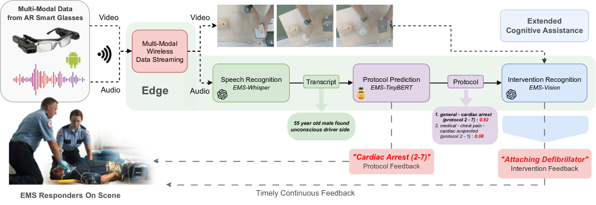

# CognitiveEMS Pipeline

## About This Project



The **CognitiveEMS Pipeline** is a real-time multimodal decision support system for Emergency Medical Services. It processes egocentric video, audio, and smartwatch IMU data from an incident scene and provides AI-generated feedback to first responders, including speech transcription, EMS protocol predictions, object detection, and activity recognition.

For more information, visit the [project page](https://www.nist.gov/ctl/pscr/cognitive-assistant-systems-emergency-response).

---

## Demo Overview

This branch contains a **portable Ubuntu-based demo** of the CognitiveEMS pipeline with a desktop GUI and device integrations.

### Pipeline Capabilities

| Modality | Input | Output |
|---|---|---|
| **Speech** | Audio stream (16 kHz mono PCM) | Running transcript, protocol predictions |
| **Vision** | Egocentric video (480×270 BGR24) | Object detections, activity recognition |
| **IMU** | Smartwatch accelerometer CSV | Hand movement display |

### Data Sources

- **`simulator`** — receives a synchronized SRT stream (video + audio + CSV) from the [EgoEMS-Sim](https://github.com/UVA-DSA/EgoEMS-Sim) simulation server
- **`smartglass`** — receives a live WebRTC stream from a Vuzix M4000 running the EgoStreamer Android app
- **`local files`** — reads a local `.mp4` and `.csv` directly without any network connection; intended for offline evaluation and batch testing

---

## High-Level Architecture

```
┌─────────────────────────────────────────────────────────┐
│                   Desktop GUI (main.py)                 │
│                                                         │
│  ┌─────────────┐  ┌──────────────┐  ┌──────────────┐   │
│  │ SRTReceiver │  │ WebRTCServer │  │LocalSampler  │   │
│  │  (simulator)│  │ (smartglass) │  │(local files) │   │
│  └──────┬──────┘  └──────┬───────┘  └──────┬───────┘   │
│         └────────────────┴──────────────────┘           │
│                          │ Named pipes                   │
│         ┌────────────────┼──────────────────┐           │
│         ▼                ▼                  ▼           │
│  /tmp/emsvid      /tmp/emsaud         /tmp/emscsv       │
│  /tmp/emsvidml    /tmp/emsaudml                         │
│         │                │                  │           │
│  ┌──────▼──────┐  ┌──────▼───────┐  ┌──────▼───────┐   │
│  │VisionProcess│  │ AudioProcess │  │  IMUProcess  │   │
│  │  (display)  │  │ (playback)   │  │  (display)   │   │
│  └──────┬──────┘  └──────┬───────┘  └──────────────┘   │
│         │                │                              │
│  ┌──────▼──────┐  ┌──────▼───────┐                     │
│  │VideoMLClient│  │WhisperProcess│                     │
│  │  → Docker   │  │ egosim_      │                     │
│  │    :8000    │  │ stream       │                     │
│  └──────┬──────┘  └──────┬───────┘                     │
│         │                │                              │
│  ┌──────▼──────┐  ┌──────▼───────┐                     │
│  │Activity /   │  │  Protocol    │                     │
│  │Detection    │  │  Prediction  │                     │
│  │ Results     │  │ (TinyBERT)   │                     │
│  └─────────────┘  └──────────────┘                     │
└─────────────────────────────────────────────────────────┘
```

Data flows from a source into **named FIFO pipes** in `/tmp/`. Separate processes read from these pipes in parallel — one for display, one for ML inference — so slow ML inference never blocks the video display.

---

## Repository Layout

```
EMS-Pipeline/
├── Demo/
│   ├── main.py                        ← Entry point
│   ├── GUI/
│   │   └── main_window.py             ← PyQt5 GUI (MainWindow)
│   ├── IO/
│   │   ├── srt_receiver.py            ← SRT packet receiver → named pipes
│   │   ├── local_file_sampler.py      ← Local file playback → named pipes
│   │   ├── webrtc_server.py           ← WebRTC server for smartglass
│   │   ├── stream_manager.py          ← Whisper & Google STT process managers
│   │   ├── video_stream.py            ← Video reader process & display thread
│   │   ├── imu_stream.py              ← IMU reader process & display thread
│   │   ├── audio_output.py            ← Audio playback process
│   │   ├── feedback_engine.py         ← Action feedback pub/sub (log-file based)
│   │   └── bbox_engine.py             ← Bounding-box pub/sub (log-file based)
│   ├── EMS_Speech/
│   │   └── EMS_Whisper/
│   │       └── whisper.cpp_realtime_stream/   ← Whisper C++ submodule
│   │           ├── models/                    ← Model weights (.bin files)
│   │           └── build/bin/egosim_stream    ← Built binary
│   ├── EMS_CPR/
│   │   ├── cpr_depth_reader.py                ← Arduino VL6180 CPR sensor reader + FIFO publisher
│   │   ├── cpr_data_visualizer.py             ← Standalone CPR depth waveform/rate GUI
│   │   └── arduino/
│   │       └── vl6180_cpr_depth/              ← Arduino sketch for CPR manikin distance sensor
│   ├── EMS_Agent/
│   │   └── Interface/
│   │       └── models/
│   │           └── DKEC-TinyClinicalBERT/
│   │               └── model.pt               ← Protocol prediction model
│   └── EMS_Vision/
│       └── video_ml_client.py                 ← VideoMLClient QThread
├── Tools/
│   └── EMS_Vision/
│       └── README_container_inference.md      ← Docker inference server guide
├── Android/
│   └── EgoStreamer/                           ← Smartglass Android app submodule
└── Assets/                                    ← Images for this README
```

---

## Hardware Requirements

### Recommended

| Component | Specification |
|---|---|
| Processor | 12th Gen Intel Core i7 or i9 |
| RAM | 32 GB |
| GPU | NVIDIA RTX 3080 or higher |
| Smartglass | Vuzix M4000 |
| Smartwatch | Samsung Galaxy Watch 5 |

### Minimum

| Component | Specification |
|---|---|
| Processor | 12th Gen Intel Core i5 |
| RAM | 16 GB |
| GPU | NVIDIA RTX 3060 |

> **GPU architecture note:** The Docker inference server uses TensorRT engines compiled for a specific GPU. Prebuilt images target RTX 3060/3080 (Ampere, sm_86). If you have an RTX 4000-series or newer (Ada Lovelace, sm_89+), you will need to rebuild the engines on your machine. See [Tools/EMS_Vision/README_container_inference.md](Tools/EMS_Vision/README_container_inference.md).

---

## Software Requirements

| Component | Requirement |
|---|---|
| OS | Ubuntu 20.04 LTS or 22.04 LTS (64-bit) |
| CUDA | 11.8 (tested); 12.x also supported |
| Conda | Anaconda or Miniconda |
| Docker | Required for the vision inference server |
| NVIDIA Container Toolkit | Required for GPU-accelerated Docker |
| Android Studio | Required only for smartglass app deployment |

> **CUDA toolkit note:** `nvidia-smi` reports the CUDA runtime version supported by your NVIDIA driver. It does not guarantee that the CUDA compiler (`nvcc`) is installed or that CMake will use the correct toolkit. On Ubuntu 20.04, `sudo apt install nvidia-cuda-toolkit` may install CUDA 10.1, which is too old for this project. Install an NVIDIA CUDA toolkit package such as `cuda-toolkit-11-8` or a supported CUDA 12.x toolkit, then point CMake at that toolkit explicitly.

---

## Installation

### 1. Clone the Repository

```bash
git clone --recurse-submodules https://github.com/UVA-DSA/EMS-Pipeline.git
cd EMS-Pipeline
git checkout demo
git submodule update --init --recursive
```

If you already cloned without `--recurse-submodules`:

```bash
git submodule update --init --recursive
```

### 2. Create and Activate the Conda Environment

```bash
conda create -n demo_ems python=3.10
conda activate demo_ems
```

### 3. Install System Packages

```bash
sudo apt update && sudo apt upgrade -y
sudo add-apt-repository universe
sudo apt update

sudo apt-get install -y \
  build-essential cmake pkg-config \
  ffmpeg \
  libsdl2-dev \
  libasound2-dev \
  portaudio19-dev libportaudio2 libportaudiocpp0 \
  libxcb-randr0-dev libxcb-xtest0-dev \
  libxcb-xinerama0-dev libxcb-shape0-dev libxcb-xkb-dev
```

Install the SRT development package for your Ubuntu release:

```bash
# Check your Ubuntu version
lsb_release -rs

# Ubuntu 20.04
sudo apt-get install -y libsrt-dev

# Ubuntu 22.04 or newer
sudo apt-get install -y libsrt-gnutls-dev
```

### 4. Install Python Packages

Install PyTorch for your CUDA version first:

```bash
pip install torch==2.5.1 torchvision==0.20.1 torchaudio==2.5.1 \
  --index-url https://download.pytorch.org/whl/cu118
```

Install PyTorch Geometric extensions:

```bash
pip install torch-scatter -f https://pytorch-geometric.com/whl/torch-2.5.1+cu118.html
pip install torch-sparse  -f https://pytorch-geometric.com/whl/torch-2.5.1+cu118.html
pip install torch-geometric==2.3.1
```

Install remaining dependencies:

```bash
pip install \
  pyqt5==5.15.11 pyqtgraph \
  transformers==4.27.2 \
  pandas openpyxl \
  pyaudio sounddevice \
  nltk \
  requests aiohttp aiortc \
  google-cloud-speech \
  opencv-python \
  netifaces \
  qrcode[pil] \
  pygame \
  jiwer scikit-learn \
  sentence-transformers
```

### 5. Build the Whisper Streaming Binary

The local speech recognition path uses a C++ Whisper runtime that must be built from source:

```bash
cd Demo/EMS_Speech/EMS_Whisper/whisper.cpp_realtime_stream

# Confirm that CMake will use a supported CUDA toolkit.
# This should print CUDA 11.8 or a supported CUDA 12.x version, not CUDA 10.1.
/usr/local/cuda-11.8/bin/nvcc --version

cmake -B build --fresh \
  -DWHISPER_SDL2=ON \
  -DGGML_CUDA=1 \
  -DCUDAToolkit_ROOT=/usr/local/cuda-11.8 \
  -DCMAKE_CUDA_COMPILER=/usr/local/cuda-11.8/bin/nvcc

cmake --build build -j --config Release
```

If you use a different supported CUDA version, replace `/usr/local/cuda-11.8` with your toolkit path, for example `/usr/local/cuda-12.3`.

Verify the binary was built:

```bash
ls build/bin/egosim_stream
```

#### Download Whisper model weights

Place the fine-tuned model file at:

```
Demo/EMS_Speech/EMS_Whisper/whisper.cpp_realtime_stream/models/ggml-finetuned-base-v203.bin
```

#### Whisper configuration

The streaming binary behaviour is controlled by three parameters in `Demo/Utils/pipeline_config.py`, overridable via environment variables:

| Parameter | Env variable | Default | Effect |
|---|---|---|---|
| `step` | `EMS_WHISPER_STEP` | `4000` ms | How often a transcript line is emitted |
| `length` | `EMS_WHISPER_LENGTH` | `16000` ms | Total audio context per inference window |
| `keep_ms` | `EMS_WHISPER_KEEP_MS` | `200` ms | Audio carried over from the previous window |

For lower transcription latency at the cost of slightly less context, try `step=2000` and `length=4000`.

### 6. Protocol Prediction Model

Download the model and place it at:

```
Demo/EMS_Agent/Interface/models/DKEC-TinyClinicalBERT/model.pt
```

### 7. Vision Inference Server (Docker)

> For full Docker inference server setup details, including building the container from source, see the [Container Inference Server README](Tools/EMS_Vision/README_container_inference.md).

The VideoML client sends JPEG-encoded frames to a local Docker container at `http://localhost:8000`. The container runs DETR object detection and an activity recognition model using TensorRT.

Use Docker Engine on Linux for GPU containers. Docker Desktop's `desktop-linux` context may not expose the host NVIDIA driver correctly.

```bash
# Confirm Docker is using the Linux Docker Engine, not Docker Desktop.
docker context ls
docker context use default

# Start Docker Engine if it is installed but stopped.
sudo systemctl enable --now docker

# Allow your user to run Docker without sudo, then log out and back in.
sudo usermod -aG docker $USER
```

After logging back in, verify Docker and GPU access:

```bash
docker run --rm hello-world
docker run --rm --gpus all nvidia/cuda:12.3.2-base-ubuntu22.04 nvidia-smi
```

If the GPU test fails, install and configure the NVIDIA Container Toolkit:

```bash
sudo apt-get install -y nvidia-container-toolkit
sudo nvidia-ctk runtime configure --runtime=docker
sudo systemctl restart docker
```

Also confirm the host NVIDIA driver is new enough for the container image:

```bash
nvidia-smi
```

The CUDA version shown by `nvidia-smi` is the maximum CUDA runtime supported by the host driver. If the container reports that the NVIDIA driver is too old, update the host NVIDIA driver or use an older compatible image tag.

```bash
# Pull the prebuilt image
docker pull keshara2032/egoems-inference-server:latest

# Start the container (requires NVIDIA GPU)
docker run --gpus all -p 8000:8000 keshara2032/egoems-inference-server:latest
```

Verify it is running:

```bash
curl http://localhost:8000/health
```

> If you see TensorRT errors about GPU architecture (`sm_` mismatch), your GPU requires local engine recompilation. See [Tools/EMS_Vision/README_container_inference.md](Tools/EMS_Vision/README_container_inference.md).

### 8. Google Cloud Speech (Optional)

For cloud-based speech recognition, place a service account key at:

```
Demo/service-account.json
```

The key must have the **Cloud Speech-to-Text API** enabled. See [Google Cloud Speech-to-Text docs](https://cloud.google.com/speech-to-text/).

### 9. Smartglass Android App (Optional)

Open the Android Studio project at:

```
Android/EgoStreamer/Android/EgoStreamer
```

1. Enable Developer Options and USB Debugging on the Vuzix M4000
2. Connect via USB and deploy from Android Studio
3. Grant camera, microphone, and network permissions on first launch

---

## Running the Pipeline

### Prerequisites Checklist

Before launching the GUI, verify:

- [ ] `conda activate demo_ems`
- [ ] Docker inference server is running: `curl http://localhost:8000/health`
- [ ] If using Whisper: `build/bin/egosim_stream` exists and model `.bin` is in place
- [ ] If using Google Speech: `Demo/service-account.json` exists
- [ ] If using simulator: the SRT sender is already streaming

### Launch

```bash
cd Demo
export LD_LIBRARY_PATH=$CONDA_PREFIX/lib:$LD_LIBRARY_PATH
python main.py
```

Upon launching, the GUI "Video Content" widget should say "Ready" after 1 second, indicating that Whisper has started.
If "Ready" is not displayed, Whisper did not start correctly. The pipeline should be restarted.

Other indications that the pipeline didn't start correctly and needs to be restarted:
- less than 5 files in /tmp/ems_session_logs
  - You should expect "vision_reader", "video_ml", "transcript", "local_checksums", "local_stats"
- Not getting transcript output in the Speech Recognition widget
- Not getting updated activity recognition inferences in the overlay of the Video Content widget
- Not getting constantly-updating output in the Vision Information widget

### Command-Line Flags

`main.py` supports several flags used by the [EgoEMS-Sim](https://github.com/UVA-DSA/EgoEMS-Sim) batch runner for automated evaluation:

| Flag | Description |
|---|---|
| `--auto-start <seconds>` | Automatically clicks Start after the given delay |
| `--source <name>` | Pre-selects a data source (`"local files"`, `"simulator"`, `"smartglass"`) |
| `--video <path>` | Pre-fills the video file path (local files mode) |
| `--csv <path>` | Pre-fills the CSV file path (local files mode) |

Example:

```bash
python main.py --source "local files" \
               --video /path/to/scenario.mp4 \
               --csv /path/to/imu_converted.csv \
               --auto-start 7
```

These flags are stripped before arguments reach Qt, so they do not conflict with `--datacollect`.

### Data Source Details

#### `simulator`

Receives a synchronized SRT stream. Configure the IP address and port of the SRT sender. The pipeline supports 480×270 resolution by default (configurable).

The SRT receiver uses a two-thread architecture: a tight `srt_recv()` loop pushes frames into an in-process queue, and a separate writer thread drains the queue to the named pipes. This prevents the SRT receive buffer from filling during pipe-open delays.

#### `smartglass`

Starts a local WebRTC server and displays a connection QR code. Open the EgoStreamer app on the Vuzix M4000, tap **Scan QR**, and point it at the QR code shown in the video panel.

#### `local files`

Select a local `.mp4` and a converted smartwatch `.csv`. The `LocalFileSamplerProcess` decodes both files via FFmpeg and writes to the same named pipes as the SRT receiver using identical wire formats — the rest of the pipeline is unaffected by source mode.

> Smartwatch CSV files need to be converted with `convert_imu.py` from EgoEMS-Sim before use in local files mode.

### Speech Backend

| Option | Requirements | Notes |
|---|---|---|
| **OpenAI Whisper Local Model** | `egosim_stream` built, model `.bin` present | Fully offline |
| **Google Speech Cloud Model** | Internet, `service-account.json` | Higher accuracy |

### Session Logs

Every session writes to `/tmp/ems_session_logs/`:

| File | Contents |
|---|---|
| `video_ml_<ts>.txt` | Per-frame activity predictions (`wall_time`, `frame_id`, `label`, `score`) |
| `transcript_<ts>.tsv` | Timestamped Whisper transcript (`start`, `end`, `utterance`) |
| `srt_checksums_<ts>.tsv` | Per-frame adler32 checksums (video, audio, CSV) — SRT mode |
| `local_checksums_<ts>.tsv` | Per-frame adler32 checksums — local files mode |
| `srt_stats_<ts>.tsv` | Stream statistics: fps, jitter, queue drops, dropped frames |

The transcript TSV format:

```
start       end         utterance
00:00.000   00:04.012   one two three chest compressions
00:04.200   00:08.415   AED attached clear for analysis
```

Numbers 1–9 are written as words and ≥10 as digits to match ground-truth annotation conventions.

---

## Internal Architecture Details

### Named Pipe System

Six named FIFOs in `/tmp/` decouple ingestion from processing:

| Pipe | Wire format | Consumer(s) |
|---|---|---|
| `/tmp/emsvid` | 4-byte big-endian length + BGR24 frame | `VisionProcess` (display) |
| `/tmp/emsaud` | 4-byte big-endian length + PCM s16le | `AudioProcess` (playback) |
| `/tmp/emscsv` | Newline-delimited UTF-8 CSV rows | `IMUProcess` (display) |
| `/tmp/emsvidml` | 4-byte big-endian length + BGR24 frame | `VideoMLClient` (inference) |
| `/tmp/emsaudml` | Raw PCM s16le (no length prefix) | `egosim_stream` (Whisper) |
| `/tmp/emscsvml` | Newline-delimited UTF-8 CSV rows | *(reserved)* |

All sources write the same wire format, so all downstream components work identically regardless of whether data arrives via SRT, WebRTC, or local files.

### Multiprocessing Architecture

The pipeline uses Python's `multiprocessing` with the `spawn` context to avoid OpenCV/CUDA fork issues. Key processes:

| Process | Module | Role |
|---|---|---|
| `VisionProcess` | `video_stream.py` | Reads video frames from `/tmp/emsvid` → queue |
| `AudioProcess` | `audio_output.py` | Reads audio from `/tmp/emsaud` → PyAudio |
| `IMUProcess` | `imu_stream.py` | Reads CSV from `/tmp/emscsv` → display |
| `WhisperProcess` | `stream_manager.py` | Manages `egosim_stream` subprocess, reads transcript FIFO |
| `LocalFileSamplerProcess` | `local_file_sampler.py` | FFmpeg decode → named pipes (local files mode) |
| `SRTReceiverProcess` | `srt_receiver.py` | SRT receive loop → named pipes (simulator mode) |

Qt threads (`VideoDisplayThread`, `IMUDisplayThread`, `VideoMLClient`, `TranscriptDisplayThread`) bridge the multiprocessing queues to Qt signals on the main thread.

### SRT Receiver

Socket options set by the receiver for stability:

| Option | Value | Purpose |
|---|---|---|
| `SRTO_RCVBUF` | 96 MB | Large buffer to absorb startup burst |
| `SRTO_RCVLATENCY` | 500 ms | Time for receive loop to start before buffer fills |
| `SRTO_TLPKTDROP` | 1 (enabled) | Graceful drop instead of hard error when buffer fills |

The SRT **sender** (EgoEMS-Sim) sets:

| Option | Value | Purpose |
|---|---|---|
| `SRTO_SNDTIMEO` | 2000 ms | Drop stalled client after 2 seconds instead of hanging |
| `SRTO_PEERLATENCY` | 500 ms | Inform receiver of required latency |

### VideoML Client

`VideoMLClient` runs as a QThread and:

1. Dequeues BGR24 frames from the ML video queue
2. JPEG-encodes at quality 85
3. POSTs to `http://localhost:8000/infer/detr` — DETR object detection
4. POSTs to `http://localhost:8000/infer/activity/ems_stream` — activity recognition
5. Draws bounding boxes and status overlay on the display frame
6. Publishes action feedback via `FeedbackPublisher` → `/tmp/ems_feedback.log`
7. Publishes bounding boxes via `BBoxPublisher` → `/tmp/ems_bbox.log`
8. Logs per-frame predictions to `/tmp/ems_session_logs/video_ml_<ts>.txt`

A warmup call is made at startup with a dummy black frame so GPU weights are loaded before the first real frame arrives.

### Feedback and BBox Engines

`feedback_engine.py` and `bbox_engine.py` implement a simple log-file-based pub/sub system:

- **Publishers** append newline-delimited JSON to `/tmp/ems_feedback.log` and `/tmp/ems_bbox.log`
- **Brokers** (async, polling at 100ms) tail the log files and notify awaiting coroutines
- This allows the AR smartglass and other consumers to poll for updates without a direct IPC connection to the inference process

---

## Evaluation

For batch evaluation of the pipeline against recorded scenarios, see the companion repository [EgoEMS-Sim](https://github.com/UVA-DSA/EgoEMS-Sim), which provides:

- Automated batch runner (`run_scenarios.py`) for both SRT and local files modes
- SRT streaming server (`srt_server_raw.py`)
- Activity recognition evaluation (`activity_eval.py`) — segment accuracy and frame-level F1
- Word error rate evaluation (`wer_eval.py`) with Whisper deduplication
- Frame integrity comparison (`compare_checksums.py`)
- Aggregate result summarization (`summarize_results.py`)

---

## Troubleshooting

### `egosim_stream` binary not found

```bash
ls Demo/EMS_Speech/EMS_Whisper/whisper.cpp_realtime_stream/build/bin/egosim_stream
```

If missing, build it (see Installation step 5). If the submodule directory is empty, run `git submodule update --init --recursive`.

### Whisper crashes mid-session

If you see `[WhisperProcess] Error reading transcript: string index out of range`, this is caused by a malformed token (e.g. `--` or `...`) passing through `_normalize_numbers`. Update `Demo/IO/stream_manager.py` to the latest version.

### Vision container not reachable

```bash
curl http://localhost:8000/health
docker ps | grep egoems
```

If the container exits immediately, check the container logs:

```bash
docker ps -a | grep egoems
docker logs <container_id>
```

Common Docker/GPU setup issues:

| Symptom | Likely cause | Fix |
|---|---|---|
| `Cannot connect to the Docker daemon at unix:///var/run/docker.sock` | Docker Engine is not running or not installed | Start it with `sudo systemctl enable --now docker`; if `docker.service` is missing, install Docker Engine |
| `permission denied while trying to connect to the Docker daemon socket` | Current user cannot access `/var/run/docker.sock` | Run `sudo usermod -aG docker $USER`, log out and back in, then verify `id` includes `docker` |
| `/var/run/docker.sock` is owned by `nobody:nogroup` | Socket ownership is wrong | Run `sudo chown root:docker /var/run/docker.sock && sudo chmod 660 /var/run/docker.sock` |
| `libnvidia-ml.so.1: cannot open shared object file` | Docker GPU runtime cannot see the host NVIDIA driver, often due to Docker Desktop context or missing NVIDIA Container Toolkit | Use `docker context use default`, install `nvidia-container-toolkit`, run `sudo nvidia-ctk runtime configure --runtime=docker`, and restart Docker |
| `The NVIDIA driver on your system is too old (found version 12030)` | The container's PyTorch/TensorRT stack requires a newer host NVIDIA driver than the one installed | Update the host NVIDIA driver, or run an older image tag built for your driver-supported CUDA version |
| TensorRT errors about GPU architecture or `sm_` mismatch | Prebuilt TensorRT engines do not match your GPU architecture | Rebuild the engines locally; see [Tools/EMS_Vision/README_container_inference.md](Tools/EMS_Vision/README_container_inference.md) |

Before debugging the application, this command should work:

```bash
docker run --rm --gpus all nvidia/cuda:12.3.2-base-ubuntu22.04 nvidia-smi
```

### SRT: "No room to store incoming packet"

The receive buffer fills before the pipeline starts draining it. Both sender and receiver must agree on at least 500ms latency (`SRTO_RCVLATENCY` / `SRTO_PEERLATENCY`). The EgoEMS-Sim server sets this automatically when connecting.

### SRT: slow send / disconnects mid-stream

The pipeline stopped draining packets — usually because VideoML inference fell behind. Check `/tmp/ems_session_logs/srt_stats_<ts>.tsv` for `QUEUE_FULL_DROP` events. The SRT server has a 2-second send timeout and will disconnect cleanly rather than hanging indefinitely.

### Audio: "Invalid sample rate" or BrokenPipeError

PulseAudio is not running or not reachable in the current environment. Set:

```bash
export XDG_RUNTIME_DIR=/run/user/$(id -u)
export PULSE_RUNTIME_PATH=/run/user/$(id -u)/pulse
```

In local files mode, if Whisper exits early and closes the audio ML pipe, the rest of the pipeline continues — video, display audio, and CSV are unaffected.

### Google Speech unavailable

Check internet connectivity, verify `Demo/service-account.json` is valid, and ensure `google-cloud-speech` is installed.

---

## Related Repositories

| Repository | Description |
|---|---|
| [EgoEMS-Sim](https://github.com/UVA-DSA/EgoEMS-Sim) | Batch evaluation runner, SRT server, IMU converter, WER and activity evaluation scripts |
| [EgoStreamer (Android)](https://github.com/UVA-DSA/EgoStreamer) | Smartglass streaming app (submodule at `Android/EgoStreamer`) |
