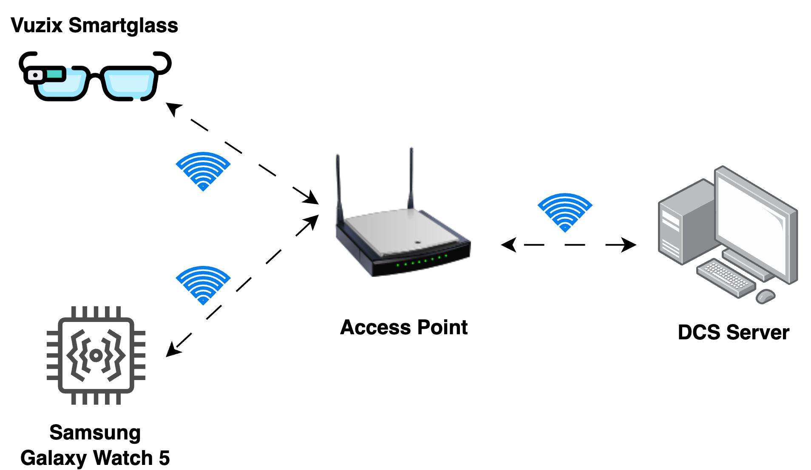

# CognitiveEMS Pipeline

## About This Project

The **CognitiveEMS Pipeline** is a decision support system designed for real-time, multimodal, and edge-deployed **Cognitive Assistant Systems for Emergency Medical Services (EMS)**. Its primary goal is to enhance situational awareness for first responders and paramedics by automatically collecting and analyzing multimodal data from incident scenes, providing actionable insights and suggestions. The system comprises advanced AI models and modular software components designed for deployment on edge devices.

For more information, visit the [project page](https://www.nist.gov/ctl/pscr/cognitive-assistant-systems-emergency-response).

---

## Demo Branch Overview

This branch contains a **portable demo** of the CognitiveEMS pipeline, featuring a GUI for Ubuntu-based systems. The demo includes:

### Server Features
- Real-time **speech recognition**.
- **Protocol prediction** based on incident data.
- **EMS object detection**.
- Preliminary version of **EMS intervention detection**.

### AR Smartglass Features
- **Augmented Reality (AR)** feedback displaying:
  - Predicted protocols.
  - Detected EMS objects.
  - Detected interventions.
- Real-time streaming of egocentric video and audio.

### Smartwatch Features
- Real-time streaming of **hand movement data**.

---

## High-Level Architecture

The CognitiveEMS pipeline employs a real-time, multi-threaded architecture to process multimodal data inputs. Its main components include:

### Core AI Models
1. **EMS-Whisper**: A fine-tuned speech recognition model for EMS audio inputs.
2. **EMS-TinyBERT**: A protocol prediction model utilizing medical knowledge and transcript analysis.
3. **EMS-Vision**: An intervention recognition model leveraging contextual knowledge and video data.


For detailed descriptions of the models, refer to the [Technical Documentation](#technical-documentation).

---

## Hardware Requirements

### Recommended Specifications

#### Server
- **Processor**: 12th Gen (or newer) Intel® Core™ i5, i7, or i9.
- **RAM**: 32GB.
- **Graphics**: NVIDIA RTX 3080 or higher.

#### Smartglass
- **Model**: [Vuzix M4000 Smart Glasses](https://www.vuzix.com/products/m4000-smart-glasses).

#### Smartwatch
- **Model**: Samsung Galaxy Watch 5.

---

### Minimum Specifications

#### Server
- **Processor**: 12th Gen Intel® Core™ i5
- **RAM**: 16GB.
- **Graphics**: NVIDIA RTX 3060

---

## Software Requirements

#### Server
- **OS**: Ubuntu 20.04.6 LTS (64-bit).
- **CUDA**: Version 12.1.
- **Environment**: Conda (Python 3.8.18).

#### Smartglass
- **OS**: Android OS.

#### Smartwatch
- **OS**: Android Wear OS.

---

## Prerequisites

### Network Configuration
- Ensure the server, smartglass, and smartwatch are on the **same network**.
- Assign a **static IP** to the server and configure it in the Android applications.
- Remove any firewall rules blocking TCP or UDP traffic.



---

## Installation 

:exclamation: Following is a work in progress.


### 1. Clone the Repository
```bash
git clone https://github.com/UVA-DSA/EMS-Pipeline.git
git checkout server
todo
```

### 2. Conda Environment Setup
#### Standard Setup
For hardware matching [recommended specifications](#hardware-requirements), use the provided `environment.yml` file:
```bash
cd Pipeline/
conda env create --file environment.yml
conda activate CogEMS
```

#### Custom Setup
For other hardware configurations:
```bash
conda create --name CogEMS python=3.8.18
conda activate CogEMS
```
Manually install dependencies:
1. Identify your CUDA version using `nvidia-smi`.
2. Use the [PyTorch installation guide](https://pytorch.org/get-started/locally/) to install PyTorch, torchvision, and torchaudio for your system.
3. Install additional packages:
```bash
conda install pyaudio
pip install torch-geometric pyyaml transformers pyqt5 pandas openpyxl evaluate jiwer
```

### 3. Virtual Speaker and Mic Setup
For audio input:
```bash
pactl load-module module-null-sink sink_name="virtual_speaker" sink_properties=device.description="virtual_speaker"
pactl load-module module-remap-source master="virtual_speaker.monitor" source_name="virtual_mic" source_properties=device.description="virtual_mic"
```

Set the `LD_LIBRARY_PATH`:
```bash
export LD_LIBRARY_PATH=/usr/lib/aarch64-linux-gnu/alsa-lib/:$LD_LIBRARY_PATH
```

---

## Model Setup

### EMS-Whisper
1. Download the `models` folder from [here](#) and place it under `Pipeline/EMS_Whisper/models/`.

### EMS-TinyBERT
1. Download the `models` folder from [here](#) and place it under `Pipeline/EMS_TinyBERT/models/`.

---

## Google Cloud Speech-to-Text API (Optional)

To enable cloud-based speech recognition:
1. Obtain a service account JSON key with the Speech API enabled.
2. Place it under the `Pipeline/` folder as `service-account.json`.
3. For more information, visit the [Google Cloud Speech-to-Text API](https://cloud.google.com/speech-to-text/) page.

---

## Usage

### Running the Cognitive Assistant Server
TBD.

### Running the AR Smartglass Application
TBD.

### Running the Smartwatch Application
TBD.

---

## Technical Documentation
Coming soon.

---

